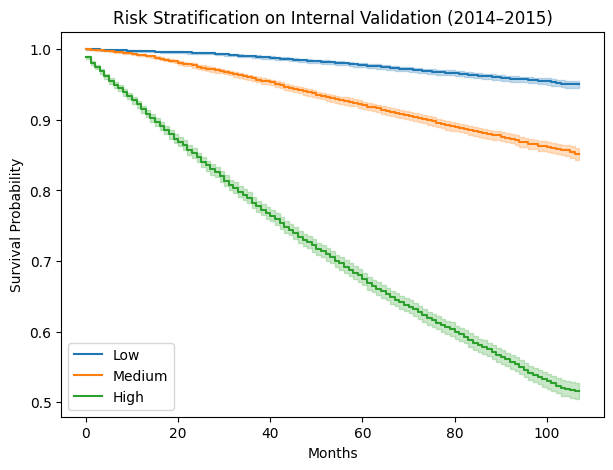
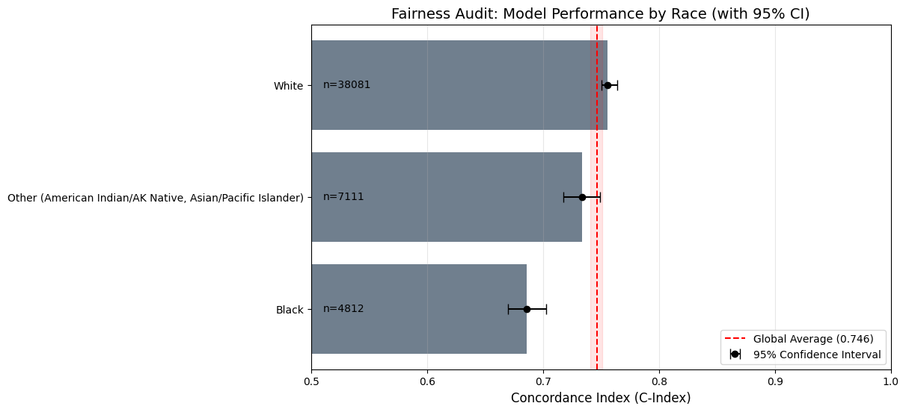

# equity-aware-survival-analysis
An equity-aware audit of breast cancer survival models, examining temporal robustness, subgroup performance disparities, and catastrophic false-negative failure modes.

# Overview

Clinical survival models often report strong global accuracy while silently failing the very patients they are intended to protect. This project develops and critically audits a nonlinear survival modeling framework to demonstrate that predictive performance alone is an insufficient criterion for clinical safety.

The Equity-Aware Survival Risk Framework (EASRF) is a research-oriented pipeline built around a Random Survival Forest (RSF), augmented with fairness auditing, failure-mode analysis, and uncertainty-aware risk stratification. Rather than optimizing accuracy in isolation, this work interrogates who the model fails on, how often, and why.

This repository reflects a deliberate shift from “Can we predict?” to “When should we not trust the prediction?”

⸻

# Research Questions

This project is structured around the following questions:
	1.	Does a nonlinear survival model (RSF) outperform a classical Cox Proportional Hazards model under external temporal validation?
	2.	Are strong global metrics masking demographic disparities in model performance?
	3.	Do rare but catastrophic failure modes exist, even when overall error rates appear negligible?
	4.	How should uncertainty and model blind spots be surfaced in a clinical decision-support context?

⸻

# Dataset & Cohort Design
	•	Source: SEER breast cancer registry
	•	Cohort Size: 50,355 patients
	•	Outcome: Overall survival
	•	Validation Strategy: Strict temporal split
	•	Training: 2004–2015
	•	Testing: 2016–2018

A temporal split was intentionally chosen to simulate prospective clinical deployment and to prevent information leakage that inflates retrospective performance.

⸻

# Modeling Approach

Baseline Model
	•	Cox Proportional Hazards
	•	Serves as a linear, interpretable benchmark

Primary Model
	•	Random Survival Forest (RSF)
	•	Selected to capture nonlinear interactions and higher-order effects without proportional hazards assumptions

The RSF is not treated as a black box; its predictions are subjected to systematic post-hoc interrogation.

⸻

# Performance Evaluation

Model performance is evaluated across two dimensions:

Discrimination
	•	Concordance Index (C-index)
	•	RSF outperforms Cox under external validation

Calibration
	•	Time-dependent Brier Scores (6–60 months)
	•	Demonstrates strong probabilistic reliability at clinically meaningful horizons

Importantly, performance metrics are treated as starting points, not final conclusions.

# Quantitative Summary of Core Results

Under strict temporal external validation (2016–2018):

• Random Survival Forest (RSF): C-index = 0.746  
• Cox Proportional Hazards: C-index = 0.733  
• 5-year Brier Score (RSF): 0.089  

Despite strong global performance, failure-mode analysis revealed:

• Global false-negative rate: 0.0099%  
• False-negative rate within predicted Low-Risk group: 0.339%  

These results demonstrate that clinically consequential errors persist even when standard performance metrics indicate high reliability.

⸻

# Algorithmic Fairness Audit

Global metrics frequently obscure subgroup failures. To address this, performance is stratified by race:
	•	Stratified C-index computation
	•	Bootstrap confidence intervals
	•	Direct comparison across demographic groups

This audit reveals non-trivial performance decay in underrepresented subgroups, highlighting limitations of models trained on demographically imbalanced registries.

⸻

# Model Stress Testing & Robustness Checks

Beyond standard evaluation, this work highlights the need for adversarial stress testing of clinical models. Future analyses should examine:
	•	Sensitivity to label noise in survival outcomes
	•	Feature ablation to identify reliance on proxy variables
	•	Stability of fairness metrics under resampling

These analyses are critical for understanding model brittleness prior to clinical translation.

⸻

# Failure Mode & Sensitivity Analysis

A targeted failure analysis is conducted to identify false negatives:

Patients predicted as Low Risk who experienced early mortality.

Key Findings
	•	Global false-negative rate: 0.0099%
	•	Error rate within “Low Risk” group: 0.339%
	•	Failures cluster in patients with small but biologically aggressive tumors

Although rare, these errors are clinically catastrophic, underscoring the danger of relying solely on aggregate accuracy.

⸻

# Biological Interpretation of Model Failures

Failure cases were not treated as purely statistical artifacts. 
Patients misclassified as low-risk despite early mortality frequently presented with small primary tumors, a pattern that is clinically consistent with biologically aggressive subtypes rather than measurement noise.

Possible biological explanations include:
• High-grade or poorly differentiated tumors with rapid proliferation
• Molecular subtypes such as Triple-Negative or HER2-positive disease
• Elevated proliferative indices (e.g., Ki-67) not captured in registry data
• Early metastatic potential independent of primary tumor size

These findings underscore a structural limitation of registry-based survival modeling: clinically decisive biological mechanisms are often unobserved. Tumor size, while dominant in population-level models, is an incomplete proxy for aggressiveness.

This gap motivates future integration of molecular and genomic features to prevent systematic underestimation of risk in biologically high-grade disease.

⸻

# Hypothesis Generation for Experimental Validation

The concentration of false negatives among patients with small tumors suggests a limitation of morphology-driven risk modeling. Tumor size alone may fail to capture underlying biological aggressiveness, which is often driven by molecular and proliferative factors absent from registry data.

We hypothesize that a subset of small tumors labeled as low-risk exhibit high proliferative activity or aggressive molecular subtypes (e.g., triple-negative or HER2-positive), leading to systematic risk underestimation.

⸻

# Proposed Wet-Lab Validation Pathways

To investigate this hypothesis, future work should integrate experimental validation, including:
	•	Immunohistochemical staining for proliferation markers (e.g., Ki-67)
	•	Molecular subtype stratification using gene expression panels
	•	Comparative analysis of signaling pathway activation in false-negative cases

Such experiments would directly test whether computational failure modes align with biological aggressiveness rather than modeling artifacts.

⸻

# Immediate Experimental Next Step

As an immediate next step, I would prioritize retrospective Ki-67 stratification within the false-negative cohort, comparing proliferative indices between correctly classified low-risk patients and early-mortality false negatives. A statistically significant elevation would directly validate the hypothesis that registry-invisible proliferative biology drives systematic risk underestimation.

⸻

# Experimental Context & Current Wet-Lab Engagement

In parallel with this computational work, I am currently engaged in wet-lab research within a university biological laboratory environment. My ongoing laboratory exposure informs the biological framing of this project, particularly in interpreting model failures through mechanisms such as proliferation dynamics and molecular aggressiveness.

This dual engagement reflects an intentional effort to bridge computational modeling with experimental reasoning, rather than treating machine learning as an abstract or purely analytical exercise.

This experience has shaped my understanding of experimental constraints, biological variability, and the gap between population-level models and single-sample laboratory observations.

⸻

# Uncertainty-Aware Clinical Framing

This project intentionally avoids framing the model as a decision-maker. Instead, it demonstrates how:
	•	Rare but severe failure modes can be surfaced
	•	Risk predictions should be accompanied by uncertainty signals
	•	Automated stratification must defer to clinical judgment in edge cases

This is a research prototype, not a deployable clinical tool.

⸻

# Key Results
	•	RSF demonstrates superior discrimination over Cox (C-index: 0.746 vs 0.733)
	•	Strong 5-year calibration (Brier Score: 0.089)
	•	Significant subgroup performance disparities detected
	•	Rare but critical blind spots identified despite excellent global metrics

⸻

# Ethical & Scientific Implications

This work illustrates a central tension in medical AI:

High accuracy does not guarantee safety.

Models optimized for population-level performance can still systematically underestimate risk in clinically vulnerable outliers. Equity-aware auditing and failure analysis are not optional extensions—they are prerequisites for responsible deployment.

⸻

# Research Trajectory

This project represents an initial step toward integrating machine learning with mechanistic oncology. The long-term research goal is to develop survival models that are not only predictive, but biologically interpretable and experimentally verifiable, enabling safer clinical deployment through hybrid computational–experimental workflows.

Future work will focus on:
• Incorporating molecular and genomic features
• Studying failure modes through experimental validation
• Developing uncertainty-aware models aligned with clinical safety

This trajectory prioritizes environments that emphasize mentored, hypothesis-driven research at the interface of computation and experimental biology, where model failure analysis can directly inform laboratory investigation.

⸻

# What This Model Is Not

This model is not a clinical decision-making system.
It is not intended to guide treatment selection or patient management.
It does not infer causality or replace molecular diagnostics.

Its purpose is to identify structural limitations, subgroup vulnerabilities, and failure modes in survival modeling, thereby informing safer and more biologically grounded future research.

⸻

# Scope of Technical Competence

This work reflects strengths in survival modeling, statistical auditing, and biological hypothesis generation. It does not claim expertise in molecular experimentation, genomic assay design, or causal inference.

The intent is to contribute computational insight that guides experimental inquiry, while learning domain-specific laboratory techniques under expert supervision.

⸻

# Limitations & Future Work
	•	Absence of genomic and molecular features
	•	Registry-based demographic imbalance
	•	No causal inference claims

Future extensions should integrate molecular biomarkers and uncertainty quantification methods to address the observed “small-tumor aggressiveness” blind spot.

⸻

# Disclaimer

This project is intended solely for research and educational purposes.
It is not validated for clinical use and must not inform patient care decisions.
